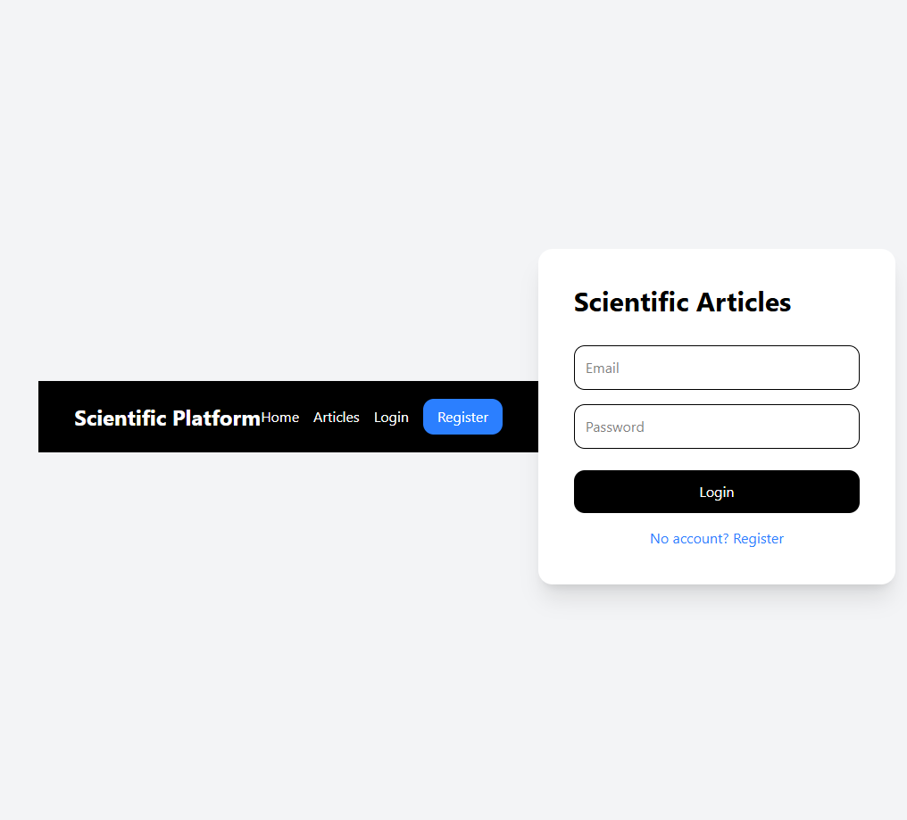
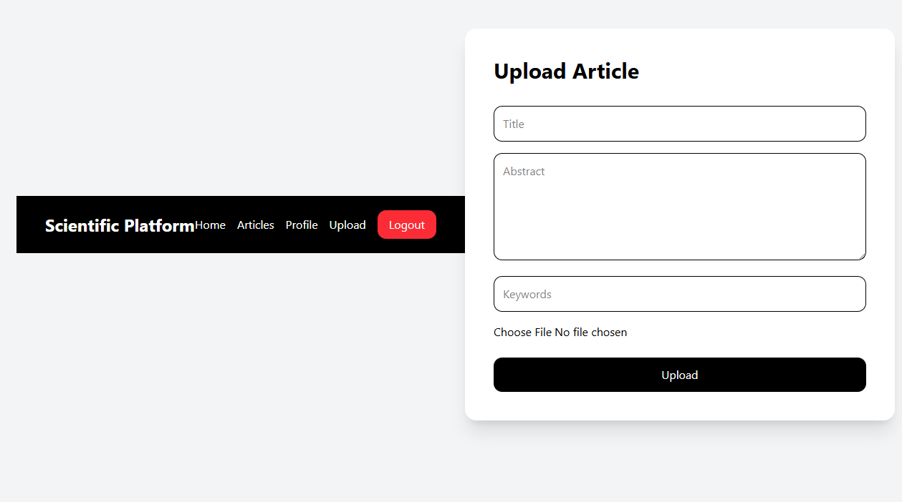
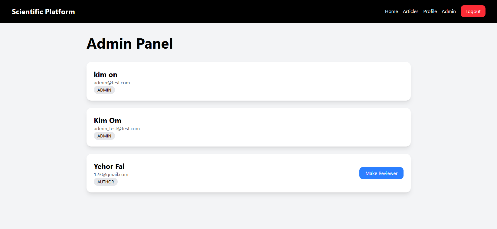
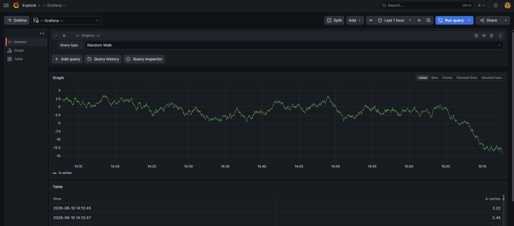

# Scientific Articles Platform


## Overview

Scientific Articles Platform is a full-stack web application designed for managing the scientific publication workflow.

The system allows users to submit scientific articles, perform peer reviews, publish accepted papers and monitor application health through integrated observability tools.

This project was developed as part of the JEE university course.

---

## Features

### User Management

- User registration
- User authentication using JWT
- Role-based access control
- Author, Reviewer and Administrator roles

### Article Workflow

- Create article submissions
- Edit article metadata
- Upload article files
- Submit articles for review
- Review assignment process
- Publication workflow

### Search and Filtering

- Search by title
- Filter by category
- Filter by status

### Monitoring

- Prometheus metrics collection
- Grafana dashboards
- Health monitoring

---

## Technology Stack

### Frontend

- React
- TypeScript
- Vite
- Axios
- React Router

### Backend

- FastAPI
- SQLAlchemy
- JWT Authentication
- Pydantic

### Database

- PostgreSQL

### DevOps

- Docker
- Docker Compose

### Monitoring

- Prometheus
- Grafana

### Testing

- Pytest

---

## Docker Deployment

The application is fully containerized using Docker Compose.

Containers:

- frontend
- backend
- postgres
- prometheus
- grafana

## Database

The application uses PostgreSQL for storing:

- users
- articles
- reviews
- notifications
- publication data

## System Architecture

```text
┌───────────────┐
│ React Frontend│
└───────┬───────┘
        │ HTTP
        ▼
┌───────────────┐
│ FastAPI       │
│ Backend       │
└───────┬───────┘
        │ SQLAlchemy
        ▼
┌───────────────┐
│ PostgreSQL    │
└───────────────┘

Prometheus ───► Backend Metrics
Grafana ──────► Prometheus
```

---

## Project Structure

```text
scientific-articles
│
├── backend
│   ├── app
│   ├── tests
│   └── requirements.txt
│
├── frontend
│   ├── src
│   └── package.json
│
├── monitoring
│   └── prometheus.yml
│
├── docker-compose.yml
│
└── README.md
```

---

## Screenshots

### Home Page


### Login Page



### Article Upload



### Admin Panel



### Grafana Monitoring



---

## Quick Start

Clone repository:

```bash
git clone https://github.com/KiYehor/scientific-articles.git

cd scientific-articles
```

Start application:

```bash
docker compose up --build
```

---

## Application URLs

Frontend

```text
http://localhost:5173
```

Backend API

```text
http://localhost:8000
```

Swagger Documentation

```text
http://localhost:8000/docs
```

Prometheus

```text
http://localhost:9090
```

Grafana

```text
http://localhost:3000
```

---

## Running Tests

Backend tests:

```bash
cd backend

pytest
```

---

## Monitoring

Application monitoring is implemented using Prometheus and Grafana.

Metrics are collected from the FastAPI backend and visualized through Grafana dashboards.

---

## Authors

University project developed for the JEE course.

Author:

- Yehor Hrytsaienko

---

## License

Educational project.